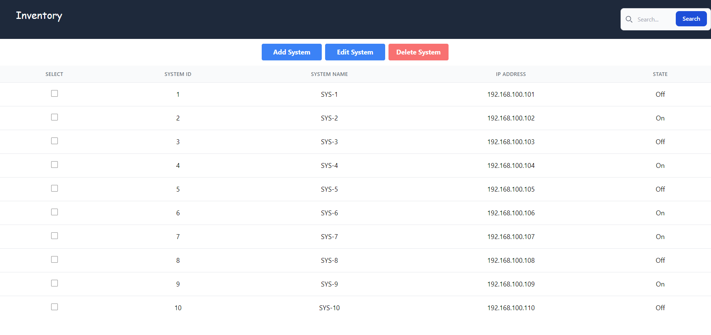

# System-Inventory 📋




## Description 📍
- System Inventory is a full stack application, used for tracking Computer System Information such as, ID, Name, IP Address, and State of the Computer System.

## Table Of Contents 📜
* [Installation](#installation)
* [Usage](#usage)
* [License](#license)
* [Contribution Guidelines](#contribution-guidelines)
* [Github Repository](#github-repository)
* [Contact](#contact-information)

## Installation 
 1. Run ``` npm i ``` in the terminal to install the required dependencies
 2. Run ```npm run seed``` to seed the database with data
 3. Run ```npm run develop``` in the bash terminal start the full stack application

## Usage 
-

##  Technologies Used
- MySql
- Express
- React
- Node

##  License
- This project uses the following license:<br>
     - ***MIT***

##  Contribution Guidelines 
- All contributors are welcome! Please don't hesitate to contact me below to contribute to this project.


##  Github Repository 
- [System Inventory Repository](https://github.com/brianalegre/System-Inventory)

##  Contact Information
- Github Profiles:
    - [Brian Alegre](https://github.com/brianalegre)


